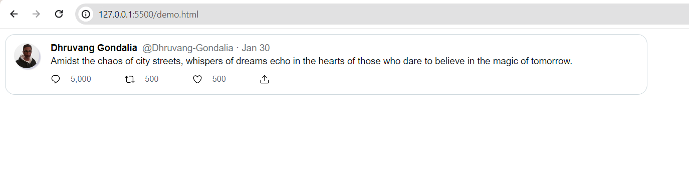

# Twitter Tweet UI

This project is a simple user interface (UI) representation of a Twitter tweet. The UI is designed to visually replicate the look and feel of a typical tweet on Twitter.

## Features

- User avatar
- Username and handle
- Tweet content
- Timestamp
- Like, retweet, and reply buttons

## Screenshot

Here is a screenshot of the Twitter Tweet UI:



## Installation

1. Clone the repository:
   ```bash
   git clone https://github.com/yourusername/twitter-tweet-ui.git

2. Navigate to the project directory:
    ```bash
    cd twitter-tweet-ui

## Usage
Open the index.html file in your preferred web browser to view the UI.